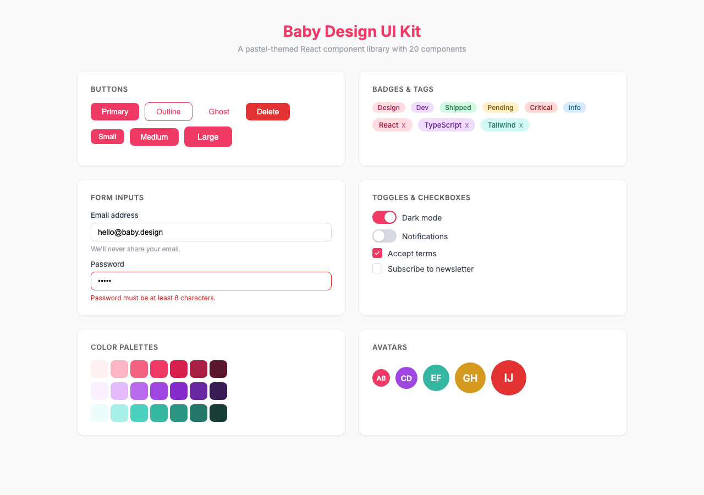
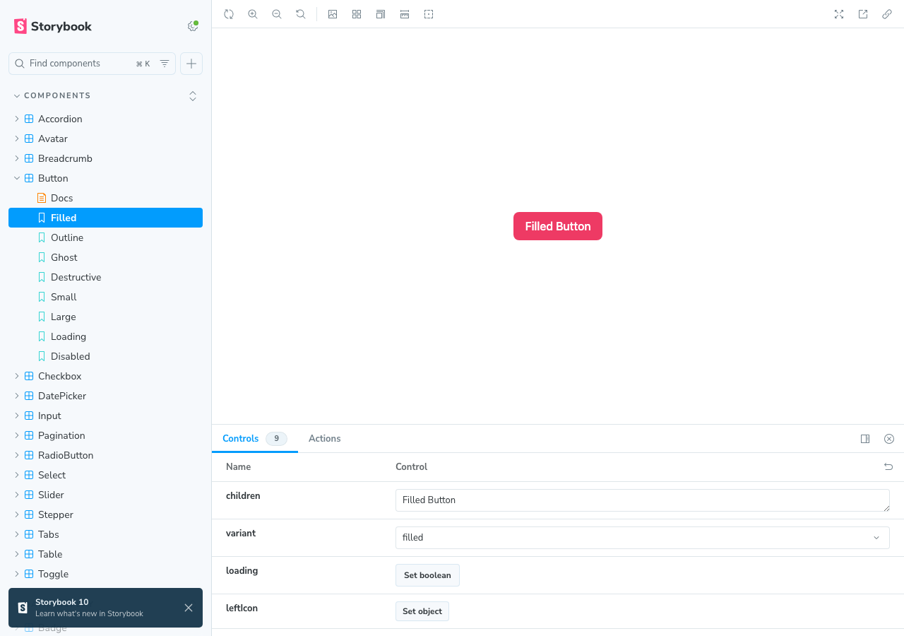

# Baby Design UI Kit

A pastel-themed React component library with an MCP server for AI-assisted development.

> **Design Credit:** Based on the [Baby Design UI Kit](https://trangtran.design) by [Trang Tran](https://trangtran.design). All visual design, color palettes, typography choices, and component specifications originate from her work.





## Packages

| Package | Description |
|---------|-------------|
| `@mcp-baby-design-ui/tokens` | Design tokens (colors, typography, spacing) — no React dependency |
| `@mcp-baby-design-ui/react` | React 18 component library (20 components) |
| `@mcp-baby-design-ui/mcp-server` | MCP server exposing 5 tools via stdio |

## Quick Start

```bash
# Install
pnpm install

# Build all packages
pnpm build

# Run Storybook
pnpm storybook

# Run tests
pnpm test
```

## Using the Component Library

```bash
npm install @mcp-baby-design-ui/react
```

```tsx
import { Button, Input, Modal } from "@mcp-baby-design-ui/react";
import "@mcp-baby-design-ui/react/globals.css";

function App() {
  return (
    <Button variant="filled" size="md">
      Click me
    </Button>
  );
}
```

## Components (20)

### Form Components
- **Button** — filled/outline/ghost/destructive, 3 sizes, loading state
- **Input** — text/password/email, label, helper text, char count, error
- **Checkbox** — default/indeterminate/checked, keyboard navigation
- **RadioButton** — radio group with arrow key navigation
- **Toggle** — switch with label, 3 sizes
- **Select** — single/multi, searchable, custom options
- **DatePicker** — calendar grid, month/year navigation
- **Slider** — single value, min/max/step

### Feedback & Overlay
- **Tooltip** — 4 positions, portal-based
- **Toast** — info/success/warning/error, auto-dismiss queue
- **Modal** — focus trap, scroll lock, ESC close
- **Badge** — filled/outline, color variants
- **Tag** — removable, with icon

### Navigation & Data
- **Pagination** — numbered, prev/next
- **Table** — sortable columns, compound pattern
- **Tab** — horizontal/vertical, keyboard navigation
- **Stepper** — numbered/bar, step states
- **Accordion** — single/multi expand mode
- **Breadcrumb** — separator, current page
- **Avatar** — image, initials fallback

## Design Tokens

9 color palettes with 10 shades each (50-900):
- **Primary** (pink), **Secondary** (purple), **Success** (green)
- **Warning** (amber), **Error** (red), **Info** (blue)
- **Neutral** (gray), **Coral**, **Teal**

Plus typography scales, spacing, border radii, and shadows.

## MCP Server

The MCP server lets AI assistants discover and generate code for components.

### Configuration

Add to your Claude Code or MCP client config:

```json
{
  "mcpServers": {
    "baby-design-ui": {
      "command": "npx",
      "args": ["-y", "@mcp-baby-design-ui/mcp-server"]
    }
  }
}
```

### Tools

| Tool | Description |
|------|-------------|
| `list-components` | List all components with descriptions |
| `get-component-docs` | Detailed docs, props, usage for a component |
| `generate-component-code` | Generate TSX code with specific props |
| `get-theme-tokens` | Retrieve design tokens |
| `preview-component` | Text preview + code example |

## Development

```bash
# Build tokens first (UI depends on it)
pnpm --filter @mcp-baby-design-ui/tokens build

# Build UI library
pnpm --filter @mcp-baby-design-ui/react build

# Build MCP server
pnpm --filter @mcp-baby-design-ui/mcp-server build

# Run all tests
pnpm test

# Storybook
pnpm storybook
```

## Tech Stack

- React 18 + TypeScript
- Tailwind CSS + CSS custom properties
- class-variance-authority (cva) for variants
- Vite for library build
- @modelcontextprotocol/sdk for MCP server
- Storybook for component docs
- Vitest + React Testing Library for tests

## Credits

Design by [Trang Tran](https://trangtran.design) — [Baby Design UI Kit](https://trangtran.design).

## License

MIT
